# Clubicles System Architecture & Flowcharts

## Table of Contents

1. [System Architecture Overview](#system-architecture-overview)
2. [User Onboarding Flows](#user-onboarding-flows)
3. [Booking & Payment Flow](#booking--payment-flow)
4. [VIBGYOR Tracking System](#vibgyor-tracking-system)
5. [Admin Approval Workflows](#admin-approval-workflows)
6. [QR Code Redemption Flow](#qr-code-redemption-flow)
7. [Database Entity Relationships](#database-entity-relationships)

---

## System Architecture Overview

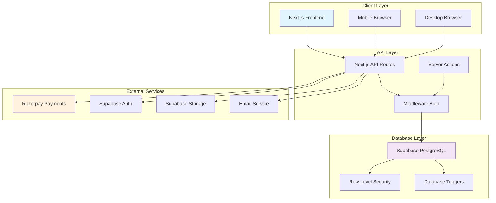

---

## User Onboarding Flows

### Individual User Registration

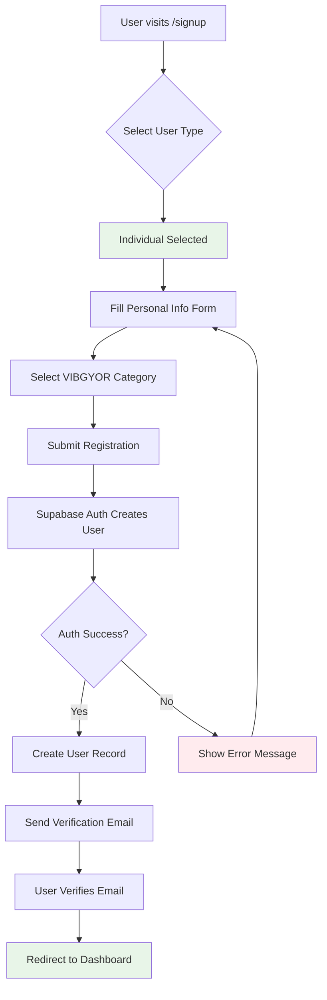

### Space Owner Registration

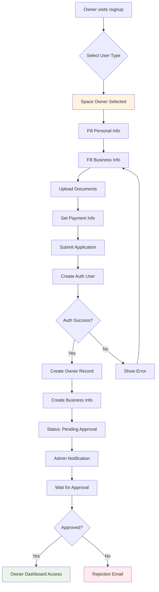

---

## Booking & Payment Flow

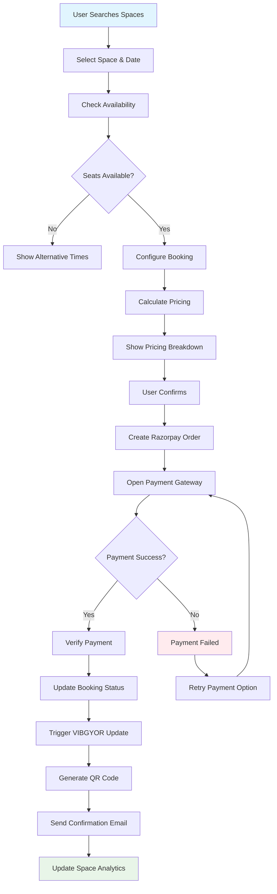

### Payment Processing Detail

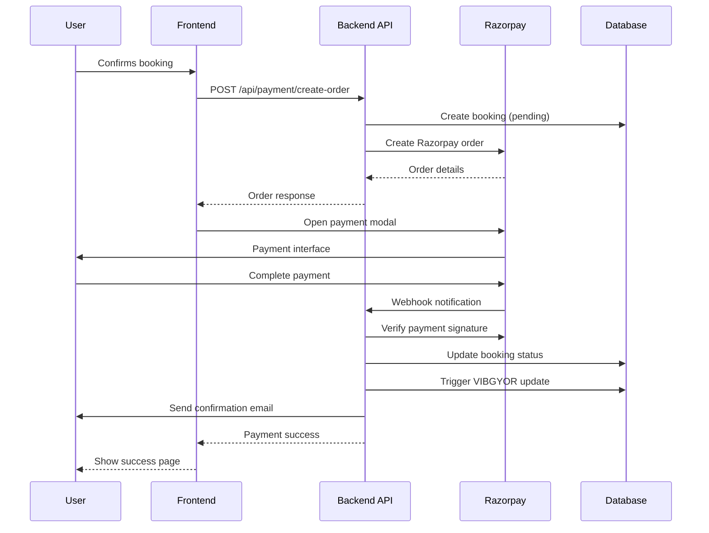

---

## VIBGYOR Tracking System

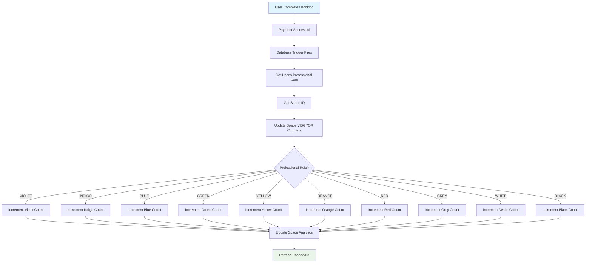

### VIBGYOR Database Trigger

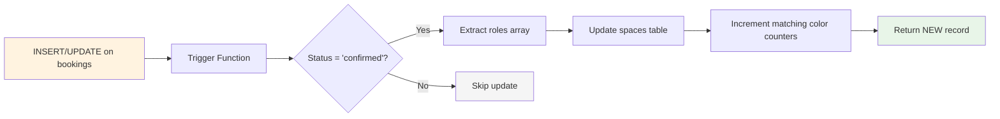

---

## Admin Approval Workflows

### Business Verification Flow

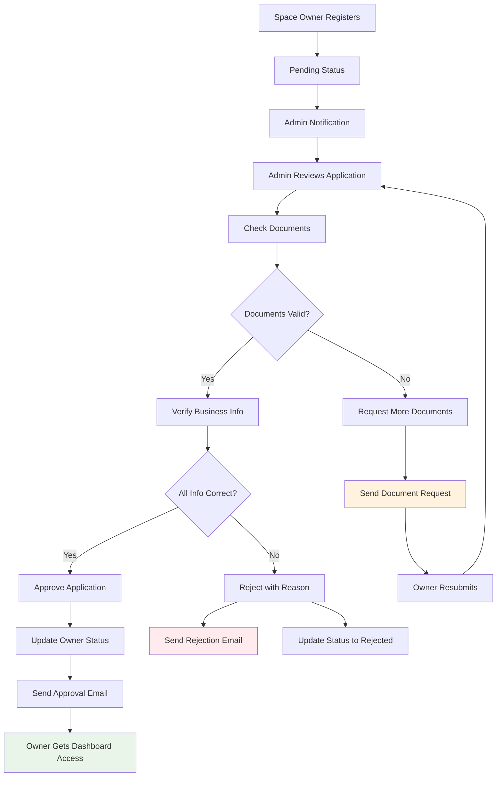

### Tax Configuration Management

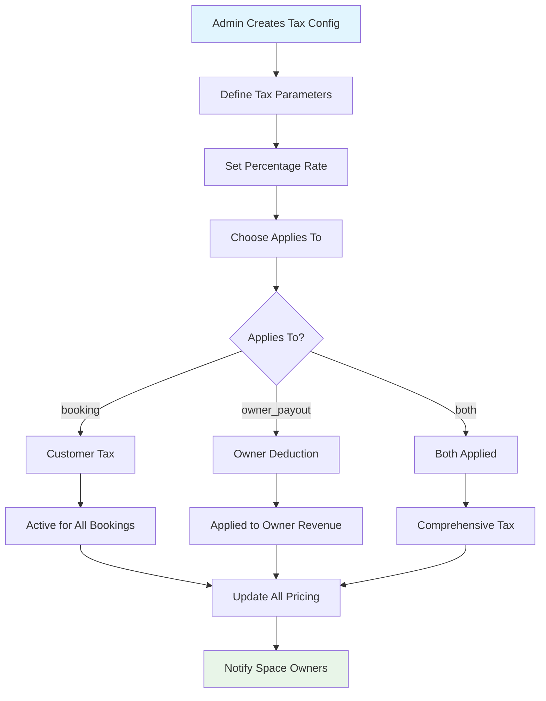

---

## QR Code Redemption Flow

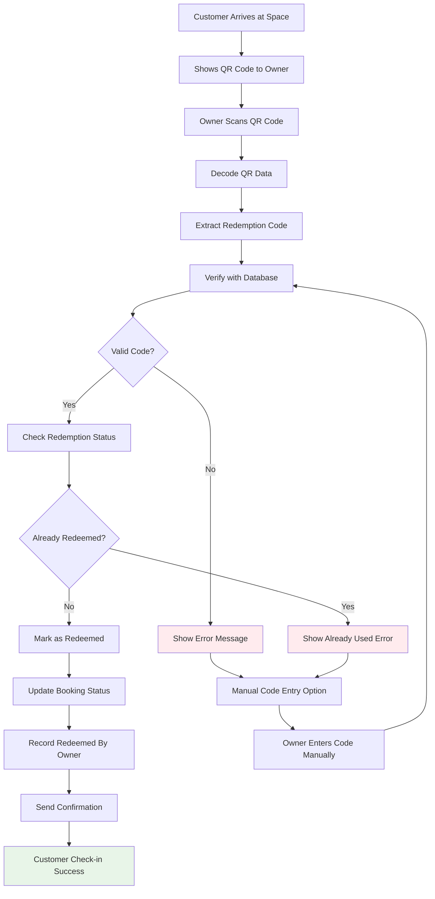

### QR Code Generation Process

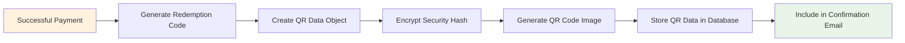

---

## Database Entity Relationships

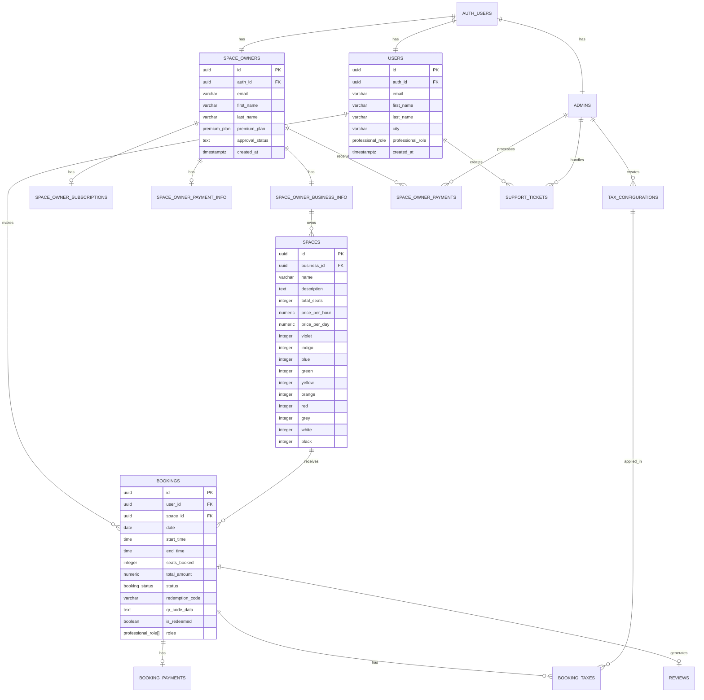

---

## Authentication & Authorization Flow

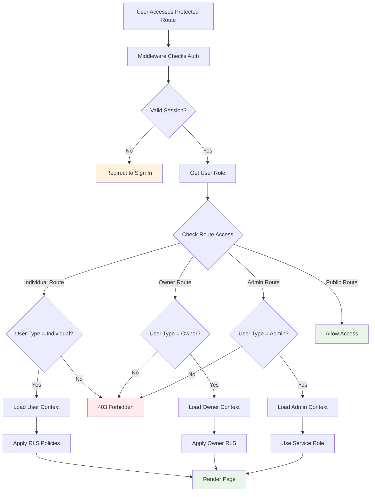

---

## Search & Discovery Architecture

```mermaid
graph TD
    A[User Types Query] --> B[Frontend Autocomplete]
    B --> C[Debounced API Call]
    C --> D[/api/search endpoint]
    D --> E[Parse Search Parameters]
    E --> F{Search Type?}
    F -->|Space Name| G[Search Spaces Table]
    F -->|City| H[Search Cities with Spaces]
    F -->|Combined| I[Full Text Search]
    
    G --> J[Apply Filters]
    H --> J
    I --> J
    
    J --> K[VIBGYOR Filter]
    K --> L[Availability Check]
    L --> M[Sort Results]
    M --> N[Return Paginated Results]
    
    N --> O[Frontend Displays]
    O --> P[User Selects Space]
    P --> Q[Navigate to Booking]
    
    style A fill:#e1f5fe
    style Q fill:#e8f5e8
```

### Search Query Processing

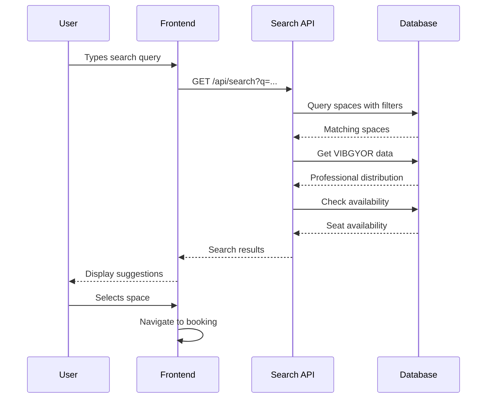

---

## Revenue Distribution System

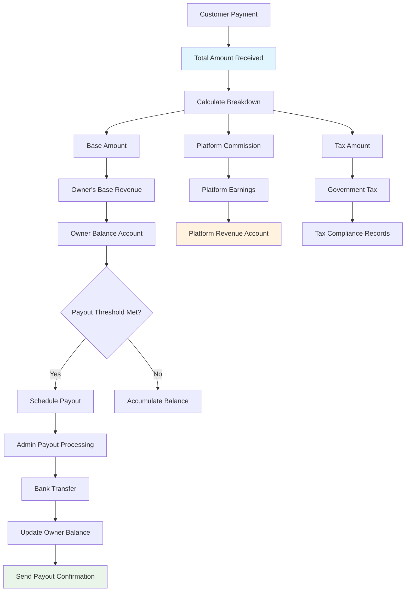

This comprehensive flowchart documentation covers all major system flows in the Clubicles platform, from user onboarding to payment processing to the unique VIBGYOR tracking system.