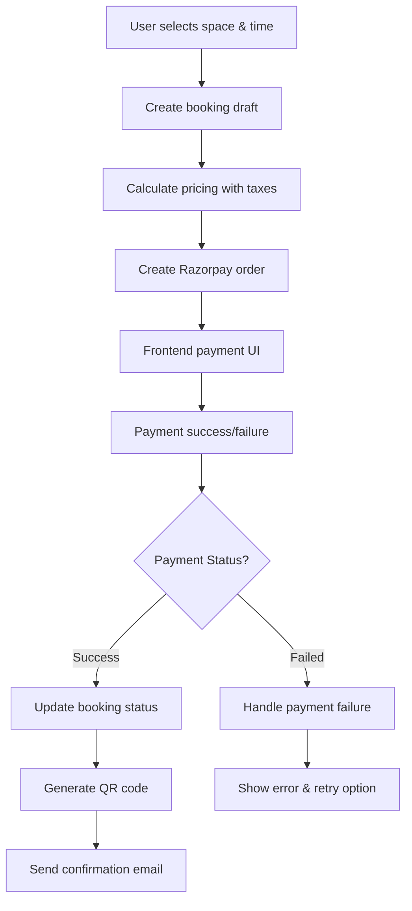

# Clubicles - Product Requirements Document

## Table of Contents
1. [Project Overview](#project-overview)
2. [User Types & Roles](#user-types--roles)
3. [VIBGYOR System](#vibgyor-system)
4. [User Stories & Features](#user-stories--features)
5. [Technical Architecture](#technical-architecture)
6. [Database Schema](#database-schema)
7. [API Endpoints](#api-endpoints)
8. [Security & Permissions](#security--permissions)
9. [Payment Integration](#payment-integration)
10. [Admin Controls](#admin-controls)

---

## Project Overview

**Clubicles** is a Next.js 15 multi-tenant coworking space booking platform that connects individual professionals with space owners through a unique VIBGYOR professional categorization system. The platform features comprehensive analytics, QR code redemption, Razorpay payments, and business management tools.

### Core Value Proposition
- **For Individuals**: Find and book professional workspaces based on their professional category with peer insights
- **For Space Owners**: Manage spaces, track VIBGYOR analytics, and optimize revenue
- **For Admins**: Platform governance, tax management, and business verification

### Key Differentiators
1. **VIBGYOR Professional Analytics**: 10-color system tracking professional types in each space
2. **QR Code Redemption**: Seamless check-in system with redemption codes
3. **Multi-Tenant Architecture**: Complete separation of user types with RLS policies
4. **Real-time Analytics**: Comprehensive business intelligence for all stakeholders

---

## User Types & Roles

### 1. Individual Users (Primary Customers)
**Profile**: Professionals seeking workspace solutions
**Access Level**: Basic user with booking capabilities
**Database Table**: `users`

#### Professional Categories (VIBGYOR):
- **VIOLET** – Visionaries & Venture Capitalists
- **INDIGO** – IT & Industrialists  
- **BLUE** – Branding & Marketing
- **GREEN** – Green Footprint & EV
- **YELLOW** – Young Entrepreneurs (<23 Years)
- **ORANGE** – Oracle of Bharat (Culture & Philosophy)
- **RED** – Real Estate & Recreationists
- **GREY** – Nomads (Multi-talented Individuals)
- **WHITE** – Policy Makers & Health Professionals
- **BLACK** – Prefer Not to Say

### 2. Space Owners (Business Operators)
**Profile**: Business owners managing coworking spaces
**Access Level**: Business dashboard with space & booking management
**Database Table**: `space_owners`

#### Plans:
- **Basic Plan**: Standard features (Default)
- **Premium Plan**: Advanced analytics, SMS notifications, dynamic pricing

### 3. Admins (Platform Managers)
**Profile**: Platform administrators managing entire ecosystem
**Access Level**: Full platform control
**Database Table**: `admins`

---

## VIBGYOR System

### Overview
The VIBGYOR system is Clubicles' unique professional tracking mechanism that provides insights into workspace composition and professional networking opportunities.

### How It Works
1. **User Registration**: Individuals select their professional category during signup
2. **Booking Tracking**: Each booking increments the corresponding color counter in the space
3. **Analytics**: Spaces display professional distribution to help users find like-minded professionals
4. **Database Triggers**: Automatic counter updates via PostgreSQL triggers

### Database Implementation
```sql
-- Spaces table VIBGYOR columns
ALTER TABLE spaces ADD COLUMN violet integer DEFAULT 0;
ALTER TABLE spaces ADD COLUMN indigo integer DEFAULT 0;
-- ... (all 10 colors)

-- Bookings table professional tracking
ALTER TABLE bookings ADD COLUMN roles professional_role[];
```

### Business Value
- **Networking**: Users find spaces with professionals in complementary fields
- **Analytics**: Space owners understand their customer composition
- **Marketing**: Targeted campaigns based on professional distribution

---

## User Stories & Features

### Individual User Stories

#### Registration & Profile Management
```
As an individual professional,
I want to create an account with my professional category,
So that I can find relevant networking opportunities.
```

**Acceptance Criteria:**
- User provides personal information (name, email, phone, city)
- User selects one VIBGYOR professional category
- Account creation triggers email verification
- Profile is immediately active after verification

#### Space Discovery & Booking
```
As an individual user,
I want to search and filter coworking spaces,
So that I can find the perfect workspace for my needs.
```

**Features:**
- Search by city, amenities, price range
- View VIBGYOR distribution of each space
- Real-time availability checking
- Detailed space information with reviews

#### Booking Management
```
As an individual user,
I want to manage my bookings and receive QR codes,
So that I can easily access booked spaces.
```

**Features:**
- View upcoming, completed, and cancelled bookings
- Generate QR codes with redemption codes
- Booking modification and cancellation
- Payment history and receipts

#### Reviews & Ratings
```
As an individual user,
I want to leave reviews for spaces I've used,
So that I can help other professionals make informed decisions.
```

**Features:**
- 5-star rating system with detailed categories
- Written reviews with professional category display
- Review editing and deletion
- Helpful/not helpful voting system

### Space Owner Stories

#### Business Onboarding
```
As a space owner,
I want to complete business verification,
So that I can start listing my spaces on the platform.
```

**Features:**
- Personal information collection
- Business details with GST/PAN verification
- Bank account setup for payouts
- Admin approval workflow

#### Space Management
```
As a space owner,
I want to create and manage my spaces,
So that I can maximize occupancy and revenue.
```

**Features:**
- Space creation with detailed information
- Image upload and gallery management
- Pricing configuration (hourly/daily rates)
- Amenities selection and descriptions

#### Booking Management
```
As a space owner,
I want to track and manage bookings,
So that I can provide excellent customer service.
```

**Features:**
- Real-time booking dashboard
- QR code scanning for check-ins
- Booking approval and rejection
- Customer communication tools

#### Analytics & Revenue
```
As a space owner,
I want to view detailed analytics,
So that I can optimize my space performance.
```

**Features:**
- VIBGYOR professional distribution
- Occupancy rates and booking patterns
- Revenue analytics with tax breakdowns
- Performance comparisons and trends

### Admin Stories

#### Platform Governance
```
As an admin,
I want to manage all platform activities,
So that I can ensure smooth operations.
```

**Features:**
- User management (all types)
- Business verification approvals
- Platform-wide analytics dashboard
- Support ticket management

#### Tax & Fee Management
```
As an admin,
I want to configure taxes and platform fees,
So that I can manage platform revenue.
```

**Features:**
- Tax rate configuration
- Platform commission settings
- Fee structure management
- Revenue distribution controls

---

## Technical Architecture

### Technology Stack
- **Frontend**: Next.js 15, React, TypeScript, Tailwind CSS
- **Backend**: Next.js API Routes, Server Actions
- **Database**: Supabase (PostgreSQL with RLS)
- **Authentication**: Supabase Auth
- **Payments**: Razorpay
- **File Storage**: Supabase Storage
- **Deployment**: Vercel

### Multi-Tenant Architecture
```
Authentication Layer (Supabase Auth)
├── Individual Users (users table)
├── Space Owners (space_owners table)
└── Admins (admins table)

Row Level Security (RLS) Policies
├── Users see only their data
├── Space owners see their business data
└── Admins bypass RLS with service role
```

### Key Architectural Patterns
1. **RLS-First Design**: All data access controlled by database policies
2. **Service Role Segregation**: Admin operations use separate database connection
3. **Event-Driven Updates**: Database triggers for VIBGYOR counter management
4. **API Route Separation**: Distinct endpoints for each user type

---

## Database Schema

### Core Tables

#### Users Table
```sql
CREATE TABLE users (
  id uuid PRIMARY KEY DEFAULT gen_random_uuid(),
  tenant_id uuid NOT NULL DEFAULT gen_random_uuid(),
  auth_id uuid UNIQUE NOT NULL REFERENCES auth.users(id),
  email varchar UNIQUE NOT NULL,
  first_name varchar,
  last_name varchar,
  phone varchar,
  city varchar,
  professional_role professional_role,
  is_active boolean DEFAULT true,
  created_at timestamptz DEFAULT now(),
  updated_at timestamptz DEFAULT now()
);
```

#### Space Owners Table
```sql
CREATE TABLE space_owners (
  id uuid PRIMARY KEY DEFAULT gen_random_uuid(),
  tenant_id uuid NOT NULL DEFAULT gen_random_uuid(),
  auth_id uuid UNIQUE NOT NULL REFERENCES auth.users(id),
  email varchar UNIQUE NOT NULL,
  first_name varchar,
  last_name varchar,
  phone varchar,
  premium_plan premium_plan DEFAULT 'basic',
  is_active boolean DEFAULT true,
  onboarding_completed boolean DEFAULT false,
  commission_rate numeric DEFAULT 10.00,
  approval_status text DEFAULT 'pending',
  plan_expiry_date timestamptz,
  created_at timestamptz DEFAULT now(),
  updated_at timestamptz DEFAULT now()
);
```

#### Spaces Table (with VIBGYOR)
```sql
CREATE TABLE spaces (
  id uuid PRIMARY KEY DEFAULT gen_random_uuid(),
  business_id uuid NOT NULL REFERENCES space_owner_business_info(id),
  name varchar NOT NULL,
  description text NOT NULL,
  address text NOT NULL,
  city varchar NOT NULL,
  pincode varchar NOT NULL,
  total_seats integer NOT NULL,
  available_seats integer DEFAULT 0,
  price_per_hour numeric NOT NULL,
  price_per_day numeric NOT NULL,
  amenities text[] DEFAULT '{}',
  images text[] DEFAULT '{}',
  rating numeric DEFAULT 0.0,
  total_bookings integer DEFAULT 0,
  revenue numeric DEFAULT 0.0,
  -- VIBGYOR Tracking
  violet integer DEFAULT 0,
  indigo integer DEFAULT 0,
  blue integer DEFAULT 0,
  green integer DEFAULT 0,
  yellow integer DEFAULT 0,
  orange integer DEFAULT 0,
  red integer DEFAULT 0,
  grey integer DEFAULT 0,
  white integer DEFAULT 0,
  black integer DEFAULT 0,
  created_at timestamptz DEFAULT now(),
  updated_at timestamptz DEFAULT now()
);
```

#### Bookings Table
```sql
CREATE TABLE bookings (
  id uuid PRIMARY KEY DEFAULT gen_random_uuid(),
  user_id uuid NOT NULL REFERENCES users(id),
  space_id uuid NOT NULL REFERENCES spaces(id),
  start_time time NOT NULL,
  end_time time NOT NULL,
  date date NOT NULL,
  seats_booked integer NOT NULL,
  base_amount numeric NOT NULL,
  tax_amount numeric DEFAULT 0,
  total_amount numeric NOT NULL,
  owner_payout numeric NOT NULL,
  platform_commission numeric DEFAULT 0,
  status booking_status DEFAULT 'pending',
  payment_id varchar,
  booking_reference varchar UNIQUE,
  -- Redemption System
  redemption_code varchar UNIQUE,
  qr_code_data text,
  is_redeemed boolean DEFAULT false,
  redeemed_at timestamptz,
  redeemed_by uuid REFERENCES space_owners(id),
  -- VIBGYOR Tracking
  roles professional_role[],
  created_at timestamptz DEFAULT now(),
  updated_at timestamptz DEFAULT now()
);
```

### VIBGYOR Trigger System
```sql
-- Function to update VIBGYOR counters
CREATE OR REPLACE FUNCTION update_vibgyor_counters()
RETURNS TRIGGER AS $$
BEGIN
  -- Increment counters based on user's professional role
  IF NEW.status = 'confirmed' THEN
    UPDATE spaces 
    SET violet = violet + CASE 
        WHEN 'violet' = ANY(NEW.roles) THEN 1 ELSE 0 END,
        indigo = indigo + CASE 
        WHEN 'indigo' = ANY(NEW.roles) THEN 1 ELSE 0 END
        -- ... (all colors)
    WHERE id = NEW.space_id;
  END IF;
  
  RETURN NEW;
END;
$$ LANGUAGE plpgsql;

-- Trigger for VIBGYOR updates
CREATE TRIGGER vibgyor_booking_trigger
    AFTER INSERT OR UPDATE ON bookings
    FOR EACH ROW
    EXECUTE FUNCTION update_vibgyor_counters();
```

---

## API Endpoints

### Individual User APIs
```
POST /api/auth/signup/individual     # User registration
GET  /api/spaces                     # Browse spaces
GET  /api/spaces/[id]               # Space details
POST /api/bookings                  # Create booking
GET  /api/bookings                  # User's bookings
PUT  /api/bookings/[id]/cancel      # Cancel booking
POST /api/reviews                   # Submit review
GET  /api/profile                   # User profile
PUT  /api/profile                   # Update profile
```

### Space Owner APIs
```
POST /api/auth/signup/owner         # Owner registration
GET  /api/owner/dashboard           # Owner dashboard
POST /api/owner/spaces              # Create space
GET  /api/owner/spaces              # Owner's spaces
PUT  /api/owner/spaces/[id]         # Update space
GET  /api/owner/bookings            # Space bookings
POST /api/owner/bookings/[id]/redeem # Redeem booking
GET  /api/owner/analytics           # VIBGYOR analytics
GET  /api/owner/revenue             # Financial data
```

### Admin APIs
```
GET  /api/admin/dashboard           # Platform overview
GET  /api/admin/users               # All users
POST /api/admin/users/[id]/action   # User actions
GET  /api/admin/verifications       # Business verifications
POST /api/admin/verifications/[id]  # Approve/reject
GET  /api/admin/taxes               # Tax configurations
POST /api/admin/taxes               # Create tax config
PUT  /api/admin/taxes/[id]          # Update tax config
```

### Shared APIs
```
POST /api/payment/create-order      # Razorpay order
POST /api/payment/verify            # Payment verification
GET  /api/search                    # Global search
POST /api/support/tickets           # Support tickets
```

---

## Security & Permissions

### Row Level Security (RLS) Policies

#### Users Table Policy
```sql
-- Users can only see their own data
CREATE POLICY "Users can view own profile" ON users
    FOR SELECT USING (auth_id = auth.uid());

CREATE POLICY "Users can update own profile" ON users
    FOR UPDATE USING (auth_id = auth.uid());
```

#### Space Owners Policy
```sql
-- Space owners see their business-related data
CREATE POLICY "Owners can view own spaces" ON spaces
    FOR SELECT USING (
        business_id IN (
            SELECT id FROM space_owner_business_info 
            WHERE space_owner_id IN (
                SELECT id FROM space_owners 
                WHERE auth_id = auth.uid()
            )
        )
    );
```

#### Bookings Policy
```sql
-- Users see their bookings, owners see bookings for their spaces
CREATE POLICY "Booking access policy" ON bookings
    FOR SELECT USING (
        user_id IN (SELECT id FROM users WHERE auth_id = auth.uid())
        OR space_id IN (
            SELECT id FROM spaces WHERE business_id IN (
                SELECT id FROM space_owner_business_info 
                WHERE space_owner_id IN (
                    SELECT id FROM space_owners 
                    WHERE auth_id = auth.uid()
                )
            )
        )
    );
```

### Admin Service Role
```typescript
// Admin operations bypass RLS using service role
import { createClient } from '@supabase/supabase-js'

const supabaseAdmin = createClient(
  process.env.NEXT_PUBLIC_SUPABASE_URL!,
  process.env.SUPABASE_SERVICE_ROLE_KEY!, // Service role key
  {
    auth: {
      autoRefreshToken: false,
      persistSession: false
    }
  }
)
```

### Authentication Middleware
```typescript
// middleware.ts
export async function middleware(req: NextRequest) {
  const { supabase, response } = createServerClient(req)
  const { data: { session } } = await supabase.auth.getSession()
  
  // Protect all routes except public ones
  if (!session && !publicRoutes.includes(req.nextUrl.pathname)) {
    return NextResponse.redirect(new URL('/signin', req.url))
  }
  
  // Role-based access control
  const userRole = await getUserRole(session?.user?.id)
  if (!hasAccess(req.nextUrl.pathname, userRole)) {
    return NextResponse.redirect(new URL('/unauthorized', req.url))
  }
  
  return response
}
```

---

## Payment Integration

### Razorpay Integration Flow
1. **Order Creation**: Backend creates Razorpay order with booking details
2. **Payment Processing**: Frontend handles Razorpay payment flow
3. **Webhook Verification**: Backend verifies payment and updates booking
4. **Revenue Distribution**: Automatic calculation of owner payout vs platform commission

### Payment Flow


### Revenue Calculation
```typescript
interface BookingPricing {
  baseAmount: number        // Space rate × hours
  taxAmount: number         // Admin-configured tax rate
  totalAmount: number       // Customer pays this
  ownerPayout: number       // After commission & tax
  platformCommission: number // Platform earnings
}

function calculatePricing(
  baseAmount: number,
  taxRate: number,
  commissionRate: number
): BookingPricing {
  const taxAmount = baseAmount * (taxRate / 100)
  const totalAmount = baseAmount + taxAmount
  const platformCommission = baseAmount * (commissionRate / 100)
  const ownerPayout = baseAmount - platformCommission
  
  return {
    baseAmount,
    taxAmount,
    totalAmount,
    ownerPayout,
    platformCommission
  }
}
```

---

## Admin Controls

### Dashboard Metrics
- **Total Users**: Count by type (Individual, Space Owner)
- **Total Spaces**: Active spaces count
- **Total Bookings**: Platform-wide booking statistics
- **Total Revenue**: Platform earnings
- **Pending Actions**: Items requiring admin attention

### User Management
- **View All Users**: Paginated list with filters
- **User Actions**: Pause, Disable, Delete accounts
- **Professional Distribution**: VIBGYOR analytics across platform

### Business Verification
- **Verification Queue**: Pending business applications
- **Approval/Rejection**: With reason tracking
- **Document Review**: GST, PAN verification

### Tax Configuration
```typescript
interface TaxConfiguration {
  id: string
  name: string              // "GST", "Platform Fee", etc.
  percentage: number        // Tax rate
  appliesTo: 'booking' | 'owner_payout' | 'both'
  isEnabled: boolean
  description: string
}
```

### Financial Controls
- **Owner Payouts**: Manual payout processing
- **Balance Management**: Adjust owner account balances
- **Revenue Reports**: Platform earnings analytics

---

## QR Code & Redemption System

### QR Code Generation
```typescript
interface QRCodeData {
  bookingId: string
  redemptionCode: string
  userId: string
  spaceId: string
  date: string
  timeSlot: string
  encryptedHash: string     // Security verification
}

// Generate QR code after successful payment
function generateBookingQR(booking: Booking): string {
  const qrData: QRCodeData = {
    bookingId: booking.id,
    redemptionCode: booking.redemption_code,
    userId: booking.user_id,
    spaceId: booking.space_id,
    date: booking.date,
    timeSlot: `${booking.start_time}-${booking.end_time}`,
    encryptedHash: encrypt(`${booking.id}:${booking.redemption_code}`)
  }
  
  return generateQRCode(JSON.stringify(qrData))
}
```

### Redemption Flow
1. **Customer Shows QR**: At space location
2. **Owner Scans**: Using space owner dashboard
3. **Verification**: Backend validates redemption code
4. **Check-in Success**: Booking marked as redeemed
5. **Analytics Update**: VIBGYOR counters incremented

---

## Search & Discovery

### Global Search Features
- **Auto-complete**: Suggests spaces and cities as user types
- **Intelligent Filtering**: By city, amenities, price, VIBGYOR distribution
- **Geolocation**: Distance-based results
- **Availability**: Real-time seat availability

### Search Implementation
```typescript
interface SearchQuery {
  query?: string           // General search term
  city?: string           // City filter
  date?: string           // Availability date
  minPrice?: number       // Price range
  maxPrice?: number
  amenities?: string[]    // Required amenities
  professionalTypes?: VIBGYORColor[] // VIBGYOR filters
  sortBy?: 'price' | 'rating' | 'distance'
}
```

---

## Business Rules

### VIBGYOR System Rules
1. **One Category Per User**: Each individual selects one professional category
2. **Automatic Increment**: Counters update only on successful bookings
3. **Historical Tracking**: VIBGYOR data preserved for analytics
4. **Anonymous Analytics**: No personal information in public VIBGYOR displays

### Booking Rules
1. **Advance Booking**: Maximum 30 days in advance
2. **Minimum Duration**: 1 hour minimum booking
3. **Seat Availability**: Real-time validation
4. **Cancellation Policy**: Free cancellation 24 hours before booking

### Revenue Rules
1. **Commission Structure**: Configurable platform commission (default 10%)
2. **Tax Compliance**: Automatic tax calculation and reporting
3. **Payout Schedule**: Weekly payouts to space owners
4. **Minimum Payout**: ₹100 minimum for payout processing

---

## Success Metrics

### User Metrics
- **User Acquisition**: New registrations by type
- **User Retention**: Monthly active users
- **Booking Conversion**: Search to booking conversion rate

### Business Metrics
- **GMV (Gross Merchandise Value)**: Total booking value
- **Take Rate**: Platform commission percentage
- **Space Utilization**: Average occupancy across spaces

### VIBGYOR Analytics
- **Professional Distribution**: Balance across categories
- **Networking Index**: Cross-category booking patterns
- **Category Growth**: Trending professional types

---

This PRD serves as the complete specification for the Clubicles platform, covering all user stories, technical requirements, and business rules needed for successful implementation.